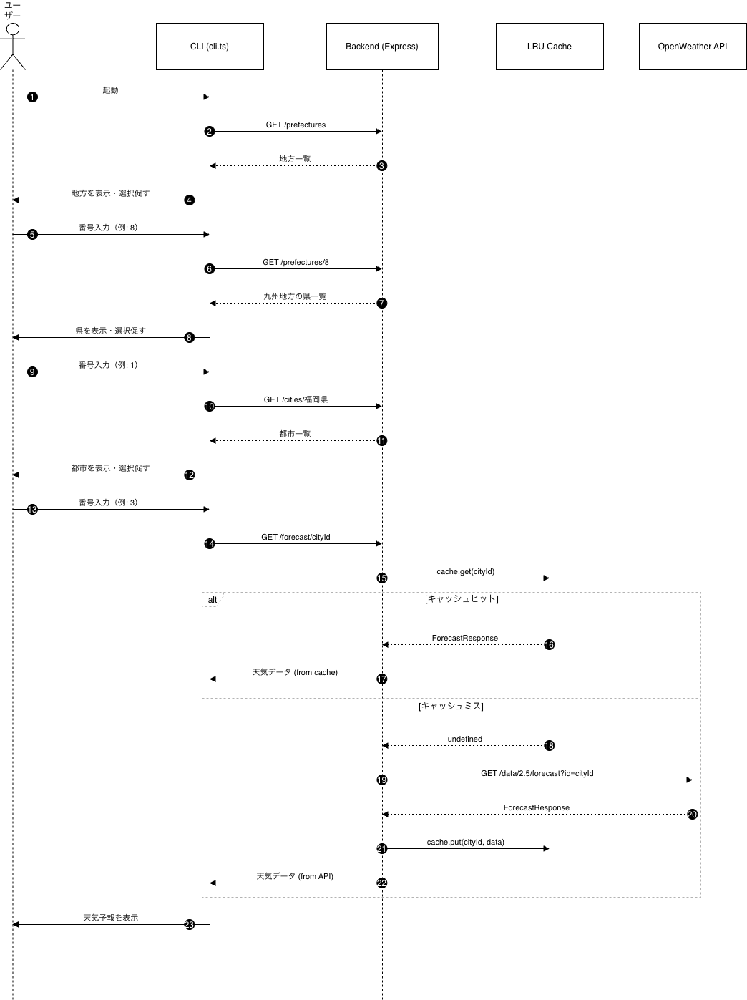

# openWeather_LRU

LRUキャッシュを用いて OpenWeather API の無駄な呼び出しを減らす CLI アプリです。

## システム概要



CLI からリクエストを受け取り、Express バックエンドが LRU キャッシュを確認します。キャッシュヒット時はそのままデータを返し、ミス時のみ OpenWeather API を呼び出します。

## セットアップ

### 1. リポジトリをクローン

```bash
git clone https://github.com/hayashu/openWeather_LRU.git
cd openWeather_LRU
```

### 2. 依存パッケージをインストール

```bash
# バックエンド
cd backend
npm install

# CLI
cd ../scripts
npm install
```

### 3. 環境変数を設定

`backend/.env` を作成し、OpenWeather API キーを設定します。

```
OPENWEATHER_API_KEY=your_api_key_here
```

API キーは [OpenWeather](https://openweathermap.org/api) から取得できます。

## 起動方法

### バックエンドを起動（ターミナル1）

```bash
cd backend
npm run dev
```

`🚀 Server running on http://localhost:3000` と表示されれば起動成功です。

### CLI を起動（ターミナル2）

```bash
cd scripts
npx tsx cli.ts
```

## 動作確認

CLI を起動すると、以下の手順で天気予報を取得できます。

```
地方を選択してください:
1: 北海道地方
2: 東北地方
...
番号を入力: 3

都道府県を選択してください:
1: 東京都
2: 神奈川県
...
番号を入力: 1

都市を選択してください:
1: Tokyo
2: Yurakucho
...
番号を入力: 2
```

バックエンドのターミナルでキャッシュの動作をログで確認できます。

```
[CACHE MISS] cityId=1850144 | 352.091ms   ← 初回：APIリクエスト
[CACHE HIT]  cityId=1850144 | 0.097ms     ← 2回目：キャッシュから返却
```

## 今後の計画

- [ ] **TTL（有効期限）の追加** — キャッシュに保存した時刻を記録し、一定時間後に自動削除することで天気データの鮮度を保つ
- [ ] **Redis への移行** — サーバー再起動時のキャッシュ消失を解決し、複数サーバーへのスケールアウトにも対応する
- [ ] **天気データの表示改善** — 5日間の予報を日付・時間帯ごとに整形して表示する
